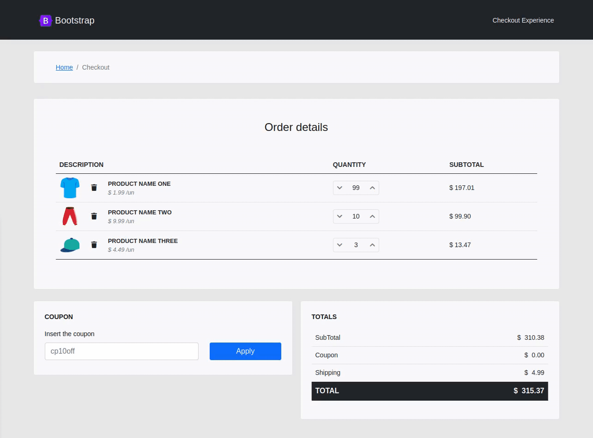
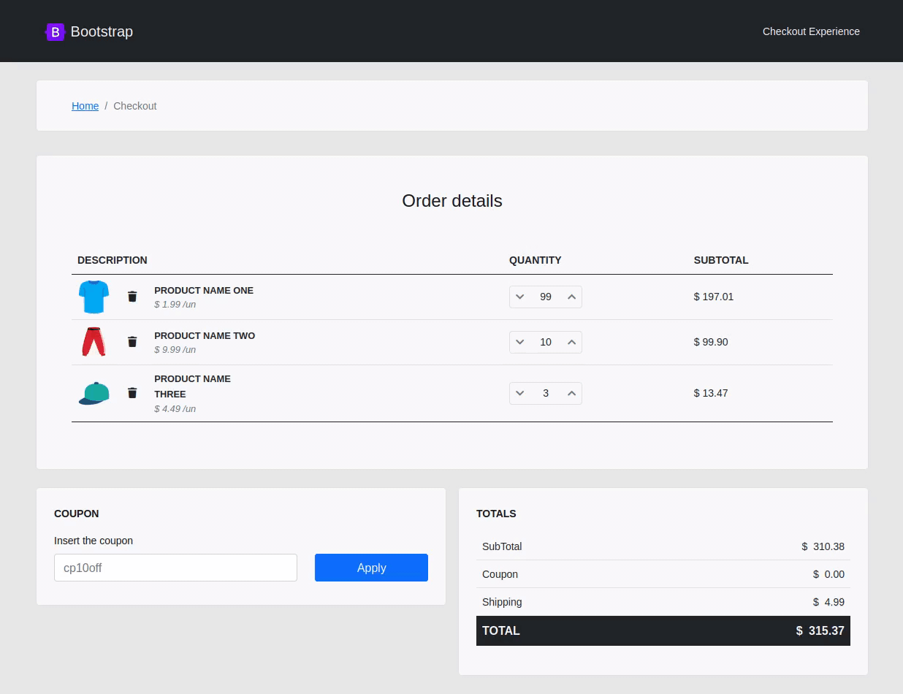

# Checkout Experience

> Scroll for demonstrations

&nbsp;

### Description

This development is about the 'Checkout' step in an online purchase.
The intention of this development was to provide a good experience for the user, thinking in a clean and simple interface with some basic effects.

### For this development.

- HTML
- Javascript
- CSS
- [Bootstrap] - Version 5.0
- [Font Awesome] - Version 5.15.2

#### To run this project

No have dependencies.

## Demonstrations

&nbsp;

#### `Demo: 'Clean Cart' `

> _Validations and animation when cleaning the cart_ > 

&nbsp;

#### `Demo: 'Items Quantity' `

> _Manipulate the quantity and update the order subtotal_ > 

&nbsp;

#### `Demo: 'Order Above $ 10'`

> _Installment payment when order above $ 10_ > 

&nbsp;

#### `Demo: 'Order Under $ 10'`

> _Installment payment when order under $ 10_ > 

&nbsp;

#### `Demo: 'To Top Button'`

> _Manipulations for 'to top' button_ > 

&nbsp;

#### `Demo: 'Making Payment'`

> _Making Payment Action_ > 

&nbsp;

#### `Demo: 'Discounts Coupon'`

> _Applying Discounts Coupon_ > 

&nbsp;

#### `Demo: 'MobileVersion'`

> _Mobile version of this development_  
> 

&nbsp;
&nbsp;

> _Note: this development focuses on the 'front-end'_

&nbsp;
If you want to leave a comment, contact me!
_I'll be happy for that._

**Thank you for read!**

[bootstrap]: https://getbootstrap.com/docs/5.0/getting-started/introduction/
[font awesome]: https://fontawesome.com/
