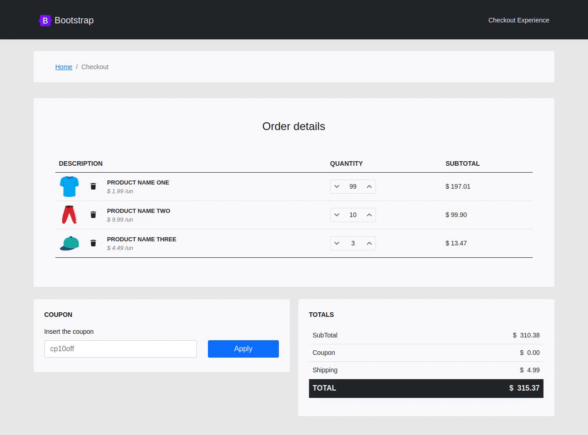

# Checkout Experience

## _Checkout stage experience_
&nbsp;
##### _* Scroll for demonstrations *_
&nbsp;
### Description

This development is about the 'Checkout' step in an online purchase.
The intention of this development was to provide a good experience for the user, thinking in a clean and simple interface with some basic effects.

### For this development.

- HTML
- Javascript
- CSS
 - Bootstrap v5.0
- Font Awesome 5.15.2

### To run this project

No have dependencies.

## Demos

### Demo: 'Clean Cart'

_Validations and animation when cleaning the cart_

### Demo: 'Items Quantity'

_Manipulate the quantity and update the order subtotal_

### Demo: 'Order Above $ 10'

_Installment payment when order above $ 10_

### Demo: 'Order Under $ 10'

_Installment payment when order under $ 10_

### Demo: 'To Top Button'

_Manipulations for 'to top' button_

### Demo: 'Making Payment'

_Making Payment Action_

### Demo: 'Discounts Coupon'

_Applying Discounts Coupon_

### Demo: 'MobileVersion'

_Mobile version of this development_
&nbsp;
##### _Note: this development focuses on the 'front-end'_
&nbsp;
If you want to leave a comment, contact me!
_I'll be happy for that._

**Thank you for read!**
